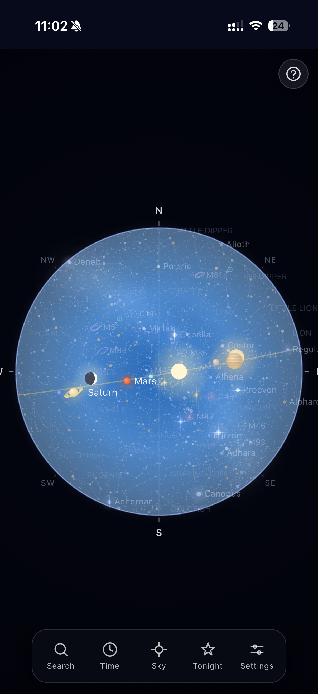
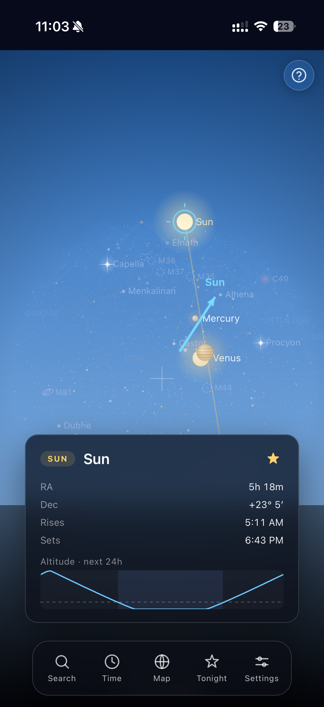
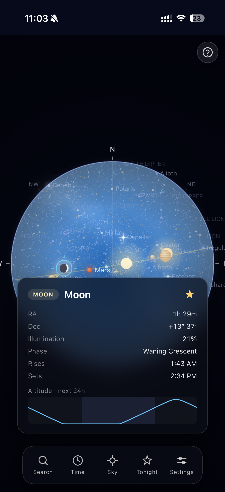
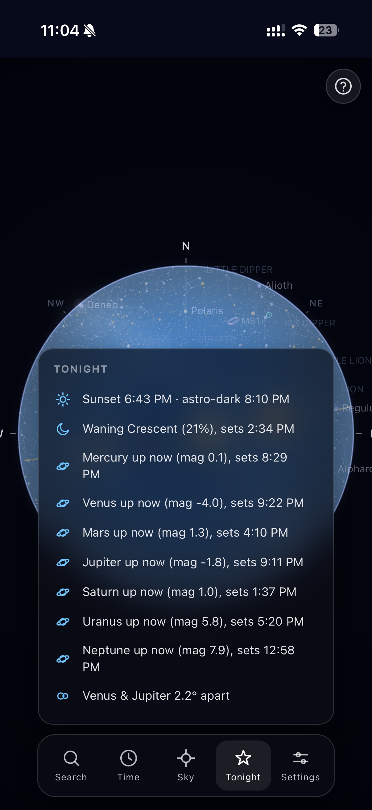
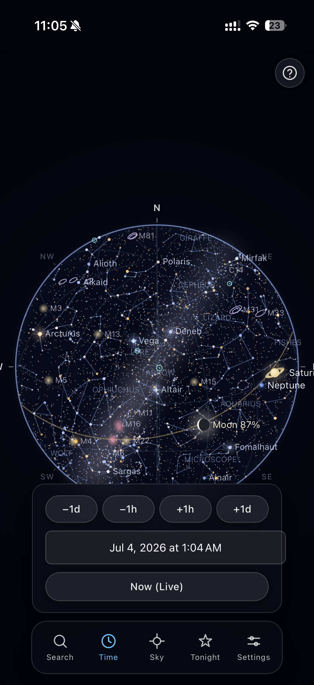

# Gallerium

A real-time, offline-first sky map that computes the positions of stars, planets, the Moon, the Sun, and satellites on-device from published astronomical algorithms. No backend, no third-party APIs, no API keys. It runs in the browser, installs as a PWA, and works with no network connection.

**Live:** [muhammadxrahman.github.io/gallerium](https://muhammadxrahman.github.io/gallerium/)

<p align="center">
  
</p>
<p align="center"><sub><b>Map (dome) view.</b> Stars colored by B-V temperature index, constellation lines, the ecliptic, and labeled planets, computed for the current location and system time.</sub></p>

## Highlights

- **Computed, not fetched.** Every star, planet, Moon, and satellite position is calculated on-device from published algorithms (Meeus solar/lunar theory, Keplerian orbital mechanics, SGP4). No backend, no third-party position APIs, no API keys, and $0 to run.
- **Real satellite tracking.** Live satellites use SGP4 propagation and topocentric look angles, drawn only when they are genuinely sunlit and your sky is dark, which is when you could actually see one.
- **Offline-first PWA.** A two-layer cache (a service-worker app shell plus IndexedDB data) lets it open and run with no network, and install to a phone home screen like a native app.
- **Off-main-thread compute.** Projecting ~9,000 stars every second runs in a Web Worker, so the render thread never hitches, with a synchronous fallback where workers are unavailable.
- **Validated, not just "looks right."** Positions are cross-checked against Stellarium and JPL Horizons, backed by 281 automated tests including a ground-truth accuracy suite.

## Overview

Gallerium turns four plain inputs into a live sky: a star catalog (HYG v4.1), a satellite element set (CelesTrak TLEs), your latitude and longitude, and the system clock. From those it computes *apparent topocentric* positions, meaning where each object actually appears for your location at this instant, then draws them in a Canvas 2D renderer with two projections: a top-down dome and a point-at-the-sky AR view. The render loop is bounded for low battery use, and the whole thing ships as an installable, offline-first PWA.

**Deep dive:** [DESIGN.md](DESIGN.md) walks through the genuinely hard parts, including why satellites need different math than stars, the two projections, moving the per-second compute off the main thread, and how the astronomy is validated.

## Features

| Feature | Description |
|---|---|
| Live sky | ~9,000 stars (HYG catalog), 7 planets (the 5 naked-eye plus Uranus and Neptune), the Sun, the Moon with its computed phase, and visible satellites, positioned in real time. |
| Deep-sky objects | An embedded Messier and Caldwell catalog (galaxies, nebulae, open and globular clusters) drawn with a distinct glyph per type, searchable and tappable for details. |
| Two views | A top-down map dome, and an AR mode that uses the device orientation sensors to overlay the sky in the direction the phone is pointed. |
| Satellite passes | SGP4 orbit propagation from live TLEs. A satellite is drawn only when it is sunlit and the observer's sky is dark, the conditions under which it is actually visible. |
| Time control | Set any date and time to plan an observation or review a past sky. |
| Search and guide | Locate any catalog object. The map centers on it; in AR an arrow indicates the direction to turn. |
| Tonight feed | Computed summary: sunset and astronomical-dark times, Moon phase, planet rise/set, conjunctions within 5°, active meteor showers (timed by solar longitude), and the next ISS pass with its track. Tap any row to be guided straight to it. |
| Tap to identify | Selecting an object shows its name, type, apparent magnitude, and rise/transit/set times. |
| Offline | Service worker precaches the app shell; IndexedDB caches the catalog and TLEs. The app opens and functions with no network. |
| Day/night sky | Background tint and star visibility track the computed Sun altitude. |
| Light pollution | A Bortle 1 to 9 selector limits the visible stars and the Milky Way to match your site, from a pristine dark sky to an inner city. |
| Night vision | A one-tap red mode that keeps the screen from emitting blue and green light, preserving your eyes' dark adaptation. |
| Altitude tonight | Each object's info card shows a sparkline of its altitude over the next 24 hours, with the dark hours shaded, so you know when to look. |
| Share the view | A link that restores the current location, time, zoom, and guided target, plus a one-tap PNG export of the sky. |
| Observing list | Save any object to a favorites list (a star toggle on its info card); saved objects float to the top of search. |
| Coordinate display | Switch the info card between horizontal (Alt/Az) and equatorial (RA/Dec) coordinates. |
| Optic field ring | Overlay the true field of view of a chosen binocular or telescope on the AR view. |
| Living sky | A cinematic first-load reveal (stars fade in brightest-first, constellation lines follow) and a gentle scintillation on the brightest stars that settles to static when idle, so the battery model holds. A first-time visitor is offered the tour automatically. |
| Smooth at scale | Projecting ~9,000 stars each second runs off the main thread in a Web Worker, so the interface never blocks, and the render loop only redraws when something actually changes. |

<p align="center">
  
</p>
<p align="center"><sub><b>AR mode.</b> A gnomonic projection centered on the device's orientation aligns the rendered sky with the pointed direction. A crosshair HUD reports current azimuth and altitude.</sub></p>

<p align="center">
  
</p>
<p align="center"><sub><b>Tap to identify.</b> Object details including apparent magnitude and computed rise, transit, and set times for the observer's location.</sub></p>

<p align="center">
  
</p>
<p align="center"><sub><b>Tonight feed.</b> Twilight times, Moon phase, planets currently up, close conjunctions, and the next visible ISS pass.</sub></p>

<p align="center">
  
</p>
<p align="center"><sub><b>Search and time control.</b> Find and be guided to any object; set the clock to any instant to compute the corresponding sky.</sub></p>

## How it works

### Coordinate pipeline

A catalog entry is a Right Ascension / Declination pair on the celestial sphere. Placing it on screen is a fixed chain of transforms:

```
catalog RA/Dec (J2000)
  1. precess to the current date        Meeus ch. 21 (axis precession ~50"/yr)
  2. Local Sidereal Time                 GMST/LST from longitude and clock
  3. Altitude / Azimuth                  equatorial-to-horizontal spherical transform
  4. atmospheric refraction              Bennett formula (true -> apparent altitude)
  5. screen pixels                       dome or gnomonic projection
```

Stars, planets, the Moon, and the Sun all use this path, so reported positions are apparent and topocentric.

### Solar system bodies

- Sun: Meeus low-precision solar theory.
- Moon: Meeus lunar theory, plus a topocentric parallax correction (Meeus ch. 40), since the Moon is near enough that the observer's position on Earth shifts it by up to ~1°.
- Planets: Keplerian elements (VSOP87-lite) for all 7 planets, including apparent magnitude and phase.
- Deep-sky objects: a curated Messier and Caldwell catalog embedded as J2000 coordinates, precessed and projected through the same far-field pipeline as the stars.

### Satellites

Satellites are near-field: the ISS orbits at ~400 km against Earth's ~6,371 km radius, so the far-field transform used for stars is wrong by tens of degrees. Gallerium runs SGP4 propagation ([satellite.js](https://github.com/shashwatak/satellite-js)) on the TLE set to obtain an Earth-centered position, then converts to topocentric look angles via `eciToEcf` and `ecfToLookAngles`. A satellite is rendered only when a cylindrical-shadow test reports it is sunlit and the Sun is below 6° altitude for the observer.

### Two projections, one renderer

The map and AR views share a single draw path and differ only in projection. The map uses an azimuthal dome; AR uses a gnomonic (pinhole) projection centered on the device's orientation. Both are pure functions from (altitude, azimuth) to pixels, so the render layer contains no astronomy math.

### Render loop

Computing alt/az for ~9,000 stars depends only on time and location, not on pan or zoom. The loop recomputes bodies on a 1 s cadence and satellites at 250 ms, and redraws only on an actual change: a recompute, a zoom/pan, an orientation move past a 0.05° threshold, or a tap. An idle map runs near 1 fps. The decision logic is a pure, unit-tested state machine. Animation stays inside this model: the first-load reveal and the transient delight rings are time-bounded, and the living-sky twinkle runs a low-rate ambient redraw only while it is dark and you have recently interacted, then settles to static.

That per-second body projection is the heaviest work, so it runs in a **Web Worker**. The worker holds the precessed catalog and, on each tick, runs the same pure compute function and posts a positions snapshot back, keeping the render thread free of a per-second stall. If Web Workers are unavailable, the loop transparently falls back to computing on the main thread.

### Offline

Two independent layers. A service worker (Workbox via `vite-plugin-pwa`) precaches the application shell. IndexedDB caches the data: the star catalog for one week, TLEs for 24 hours. Catalog and TLE fetches use ordered mirror fallback with retry and an abort timeout.

## Architecture

The three layers do not reach across each other.

```
components/   DOM, device sensors, user interaction
              toolbar, search, AR orientation, location, tap-to-identify
                            |
engine/       state and the compute pipeline, DOM-free
              SkyEngine + compute (+ Web Worker), search, highlights, scheduler, status
                            |
astronomy/                          render/
pure math, no DOM                   Canvas 2D, takes positions and draws them
coordinates, sidereal,              sky, stars, planets, moon, sun,
planets, moon, sun, refraction,     satellites, constellations, grid,
precession, parallax, riseset,      milkyway, labels, canvas
passes, satellites, referenceLines

data/   catalog and TLE loading with IndexedDB caching
utils/  clock, geolocation, fetch-with-fallback, math
```

- `astronomy/`: pure functions, no imports from `render/` or `components/`.
- `render/`: consumes computed positions, no astronomy math.
- `engine/`: holds state and composes the math plus a tested scheduling layer, no DOM.
- `components/`: the only layer that touches the DOM and device APIs.

## Tech stack

| | |
|---|---|
| Language | TypeScript (strict) |
| Rendering | Canvas 2D (no WebGL, no Three.js) |
| Concurrency | Web Worker for off-main-thread star compute |
| Build | Vite |
| Tests | Vitest, 281 tests |
| Offline / PWA | `vite-plugin-pwa` (Workbox) + IndexedDB |
| Orbit propagation | `satellite.js` (SGP4) |
| CI/CD | GitHub Actions: test and build gate, auto-deploy to GitHub Pages |
| Hosting | GitHub Pages (static) |

`satellite.js` is the only runtime dependency.

## Testing and validation

281 automated tests cover the astronomy layer, the geometry of both projections, the data parsers, the deep-sky catalog, the resilient fetch logic, and the orchestration engine (compute pipeline, search/guide resolver, Tonight feed, render-loop scheduler).

Validation uses two methods:

1. Pure geometry is asserted exactly through model-agnostic invariants: zenith maps to screen center, cardinal directions resolve correctly, objects below the horizon are culled, and the gnomonic projection maps fov/2 to the screen edge with offset = tan(angle) × focal length.
2. Computed positions are checked against Stellarium and JPL Horizons ground truth with tolerances appropriate to a visual application.

Testing the render loop surfaced a defect that would not appear in the math tests: the AR redraw gate compared device orientation against an uninitialized `NaN`, so the comparison was always false and the gate never fired on device. The test for the scheduler's first-sample case caught it.

CI runs on every push and pull request: `npm ci`, `npm run test:run`, `npm run build`. A passing push to `main` triggers the GitHub Pages deploy job, so the live site matches the latest passing build.

## Accuracy

Measured against Stellarium and JPL Horizons:

| Body | Approximate error |
|---|---|
| Sun | ~0.01° |
| Moon | ~2° |
| Planets | ~1° near J2000; degrades for dates far from epoch |

Refraction, precession, and lunar parallax are applied. Nutation and aberration are omitted; each is below 0.01° and below the visible threshold for this application. AR altitude is derived from the device orientation matrix and is correct; AR azimuth currently depends on the device compass heading and is still being tuned across hardware.

## Running locally

```bash
npm install
npm run dev      # Vite dev server over HTTPS (required for the iOS orientation API)
npm test         # watch mode
npm run test:run # one-shot, as CI runs it
npm run build    # tsc typecheck and production build
```

To test AR mode on a phone, open the `https://192.168.x.x:5173` address the dev server prints and accept the self-signed certificate.

## Data sources

| Data | Source | Cache |
|---|---|---|
| Stars | [HYG database v4.1](https://github.com/astronexus/HYG-Database) | 1 week |
| Satellites | [CelesTrak](https://celestrak.org/) visual group | 24 hours |
| Deep-sky (Messier / Caldwell) | Embedded J2000 catalog | none (static) |
| Planets, Moon, Sun | Computed on-device | real-time |

## License

MIT. See [LICENSE](LICENSE).
